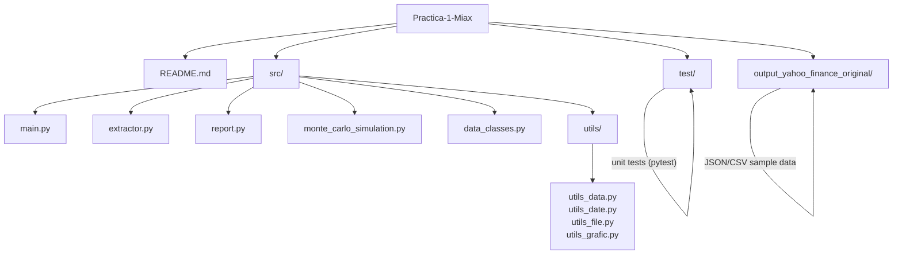

# Practica-1-Miax

Proyecto de práctica que contiene utilidades para extracción y análisis de datos financieros, simulación Monte Carlo y generación de reportes.

### Contenido principal

- `src/` : código fuente Python
  - `main.py` : punto de entrada (script principal)
  - `extractor.py`, `report.py`, `monte_carlo_simulation.py` : módulos funcionales
  - `data_classes.py` : clases de datos
  - `utils/` :  
    - utilis_data.py
    - utils_date.py
    - utilis_file.py
    - utils_grafic.py
- `test/` : pruebas unitarias (pytest)
- `output_yahoo_finance_original/` : datos descargados en formato json o csv

## Requisitos

Recomendado crear un entorno virtual y usar Python 3.10+ (o la versión que tengas instalada). Si no existe un `requirements.txt` en el repo, instala las dependencias necesarias manualmente (p. ej. `pandas`, `numpy`, `pytest`, `matplotlib`).

Ejemplo (PowerShell):

```powershell
# Crear y activar entorno virtual
python -m venv .venv
.\.venv\Scripts\Activate.ps1

# Instalar paquetes (ajusta según tu entorno)
pip install --upgrade pip
pip install pandas numpy matplotlib pytest
```

## Ejecutar el proyecto

Desde la raíz del proyecto, con el entorno activado:

```powershell
# Ejecutar el script principal
python -m src.main

# O ejecutar un módulo directamente
python src\main.py
```

## Ejecutar pruebas

Usando pytest:

```powershell
pytest -q
```

## Estructura recomendada y datos

Los archivos que se generan con los datos descargados en formato json o csv se almacenan en carpetas con el formato de nombre output_{source}_original ej: `output_yahoo_finance_original/`. Dentro de estas carpetas, se crean los archivos con el nombre del ticket_sourece_date ejCuando trabajes con nuevos tickers, coloca los ficheros en esa carpeta o ajusta las rutas en `extractor.py`.

## Notas sobre VS Code y Markdown

Si usas Visual Studio Code te recomiendo algunas extensiones Markdown útiles:

## Diagrama (FossFLOW)

A continuación hay un diagrama tipo flujo (Mermaid) que representa la estructura principal del repositorio. "FossFLOW" aquí se usa como estilo de diagrama de flujo para ilustrar la arquitectura del proyecto.



Cómo ver el diagrama:

- En GitHub: GitHub renderiza bloques Mermaid directamente en el repositorio.
- En VS Code: la vista previa de Markdown puede necesitar la extensión "Markdown Preview Mermaid Support" o usar la extensión "Markdown All in One" junto a una que soporte Mermaid. También puedes abrir el archivo en GitHub para ver el render.

Instalación rápida desde PowerShell (requiere `code` en PATH):


# Practica-1-Miax