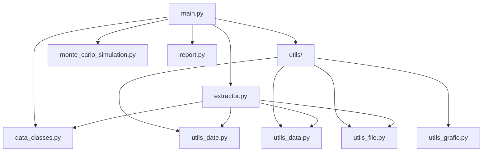

# Practica-1-Miax

Proyecto de práctica que tiene como objetivo descargar y analizar datos financieros para simular una cartera. Los pasos que sigue el código: 
- extracción de dos apis: yahoo_finance y tiingo
- estandarizan y convierten a dataClass
- análisis de datos financieros y se crean funciones y gráficas para calcular la media, la desviación típica y los pesos
- simulación Monte Carlo y gráfica
- generación de reporte.

Además hay una carpeta de test en la que ejcutan los test unitario.

### Definición de la estructura del proyecto

- `src/` : código fuente Python
  - `main.py` : punto de entrada y ejecución de funciones (script principal)
  - `extractor.py`: código donde se hacen las llamadas a las apis y se convierten los datos a dataClass
  - `data_classes.py` : se definen dataClass y se calculan las funciones estadisticas
  - `monte_carlo_simulation.py` : se calcula y representa la simulación  de Monte Carlo
  - `utils/` :  
    - utilis_data.py: contiene funciones para hacer la estandarización y conversion de datos a dataClasses 
    - utils_date.py: contiene una función para calcular la fecha inicial con el rango de entrade
    - utilis_file.py: contiene funciones para crear carpetas y guardar los datos en el formato de entrada
    - utils_grafic.py: se crean las funciones para la media, la desciación típica y los pesos para cada símbolo
- `report.py`: report en formato markdown con los resultado de la cartera    
- `test/` : pruebas unitarias (pytest)
- `output_[source]_original/` : carpeta donde se guardan los archivos con los datos de cada símbolo con el formato seleccionado, json o csv, y 

### Requisitos

Recomendado crear un entorno virtual y usar Python 3.10.

### Ejecutar el proyecto
Primero hay que activar el entorno:

```powershel
python -m venv .venv
.\.venv\Scripts\Activate.ps1
```
El proyecto se ejecuta desde la terminal, y hay que hacerlo desde la carpeta scr:


```powershel
cd src
```
La configuración de las llamadas a las apis necesita los argumentos que se introducen en la consola. Se tiene que elegir:
- source: yahoo_finance o tiingo (por defecto: yahoo_finance).
- symbol: accion/es o indice/s que se quiere usar para formar la cartera (por defecto: IBEX).
- interval: indica el periodo que toma la muesta (por defecto: un día).
- range: indica el rango de tiempo desde que se quieren datos hítoricos de los símbolos, partiendo de la fecha actual ( por defecto: cinco años).
- format: indica el formato en el que se quieren guardar los datos, son posibles json y csv (por defecto: csv).

Un ejemplo de comando de ejecución:

```powershel
python main.py --source yahoo_finance --symbol AAPL, MSFT --interval 1d --range 1y --format json
```

### Archivos que se generan y outoup

Como archivos que se generan el proyecto después de la ejecutción:
- En una carpeta, con el formato de nombre output_{source}_original ej: `output_yahoo_finance_original/`, se guardan los datos obtenidos de la api, en el formato que se haya indicado.
- Se generan archivos con formato .png con las gráficas de las funciones estadísticas.
- Se genera un archivo report.py con el resumen de la cartera calculada.

### Ejecutar pruebas

Hay que situarse en carpeta ./test:
```powershell
cd test
```
Para ejecutar los test: 
```powershell
pytest 
```

## Diagrama de clases

A continuación, se muestra un diagrama con las relaciones entre clases tomando como origen main.


