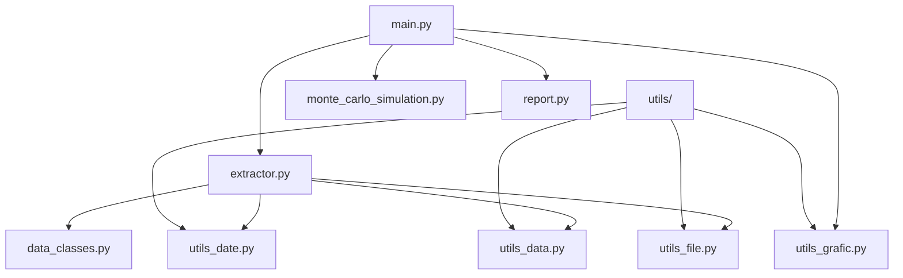

# Practica-1-Miax

Proyecto de práctica que contiene utilidades para extracción y análisis de datos financieros, simulación Monte Carlo y generación de reportes.

### Contenido principal

- `src/` : código fuente Python
  - `main.py` : punto de entrada (script principal)
  - `extractor.py`, `report.py`, `monte_carlo_simulation.py` : módulos funcionales
  - `data_classes.py` : clases de datos
  - `utils/` :  
    - utilis_data.py
    - utils_date.py
    - utilis_file.py
    - utils_grafic.py
- `test/` : pruebas unitarias (pytest)
- `output_yahoo_finance_original/` : datos descargados en formato json o csv

### Requisitos

Recomendado crear un entorno virtual y usar Python 3.10.


### Ejecutar el proyecto
Primero hay que activar el entorno:

```powershel
python -m venv .venv
.\.venv\Scripts\Activate.ps1
```
El proyecto se ejecuta desde la terminal, y hay que hacerlo desde la carpeta scr:


```powershel
cd src
```
La configuración de las llamadas a las apis necesita los argumentos que se introducen en la consola. Se tiene que elegir:
- source: yahoo_finance o tiingo (por defecto: yahoo_finance).
- symbol: accion/es o indice/s que se quiere usar para formar la cartera (por defecto: IBEX).
- interval: indica el periodo que toma la muesta (por defecto: un día).
- range: indica el rango de tiempo desde que se quieren datos hítoricos de los símbolos, partiendo de la fecha actual ( por defecto: cinco años).
- format: indica el formato en el que se quieren guardar los datos, son posibles json y csv (por defecto: csv).

Un ejemplo de comando de ejecución:

```powershel
python main.py --source yahoo_finance --symbol AAPL, MSFT --interval 1d --range 1y --format json
```

### Archivos que se generan y outoup

Como archivos que se generan el proyecto después de la ejecutción:
- En una carpeta, con el formato de nombre output_{source}_original ej: `output_yahoo_finance_original/`, se guardan los datos obtenidos de la api, en el formato que se haya indicado.
- Se generan archivos con formato .png con las gráficas de las funciones estadísticas.
- Se genera un archivo report.py con el resumen de la cartera calculada.

### Ejecutar pruebas

Hay que situarse en carpeta ./test:
```powershell
cd test
```
Para ejecutar los test: 
```powershell
pytest 
```

## Diagrama de clases

A continuación, se muestra un diagrama con las relaciones entre clases partiendo de main.


